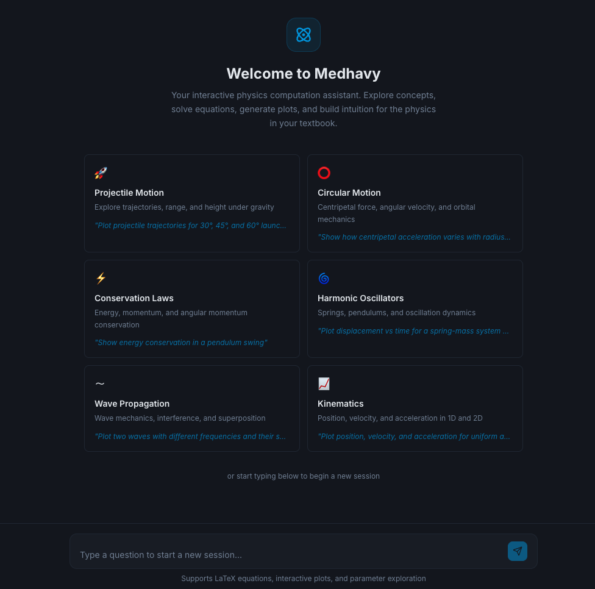

# Medhavy Physics Engine — Interactive Chat Track

An LLM-powered interactive physics tutoring chat interface integrated with the OpenStax University Physics Volume 1 textbook. Students can ask questions, run computations, generate plots, and explore physics concepts in real time.

**Live app**: [interactive-chat-track.replit.app](https://interactive-chat-track.replit.app/)

**Demo**: 
[Watch demo →](https://drive.google.com/file/d/1eT0luFxalkv6caNbJMgiT25vfqznzpqD/view?usp=sharing)

## Run & Operate

- `pnpm --filter @workspace/api-server run dev` — run the API server (port 8080)
- `pnpm --filter @workspace/physics-chat run dev` — run the frontend (port 23036)
- `pnpm run typecheck` — full typecheck across all packages
- `pnpm run build` — typecheck + build all packages
- `pnpm --filter @workspace/api-spec run codegen` — regenerate API hooks and Zod schemas from the OpenAPI spec
- `pnpm --filter @workspace/db run push` — push DB schema changes (dev only)
- Required env: `DATABASE_URL` — Postgres connection string
- Required env: `AI_INTEGRATIONS_ANTHROPIC_BASE_URL`, `AI_INTEGRATIONS_ANTHROPIC_API_KEY` — auto-provisioned by Replit AI Integrations

## Stack

- pnpm workspaces, Node.js 24, TypeScript 5.9
- Frontend: React + Vite, Tailwind CSS, shadcn/ui, Recharts, react-katex, Framer Motion
- API: Express 5
- DB: PostgreSQL + Drizzle ORM
- AI: Claude (claude-sonnet-4-6) via Replit AI Integrations (Anthropic)
- Validation: Zod (`zod/v4`), `drizzle-zod`
- API codegen: Orval (from OpenAPI spec)
- Build: esbuild (CJS bundle)

## Where things live

- **OpenAPI spec**: `lib/api-spec/openapi.yaml` — source of truth for all API contracts
- **DB schema**: `lib/db/src/schema/` — `conversations.ts`, `messages.ts`
- **API routes**: `artifacts/api-server/src/routes/` — `anthropic/`, `physics/`, `health.ts`
- **Frontend pages**: `artifacts/physics-chat/src/pages/ChatPage.tsx`
- **Rich message renderer**: `artifacts/physics-chat/src/components/MessageRenderer.tsx`
- **Theme**: `artifacts/physics-chat/src/index.css` — dark navy/teal/amber scientific theme
- **AI integration lib**: `lib/integrations-anthropic-ai/`

## Architecture decisions

- **SSE streaming for chat**: The AI message endpoint uses Server-Sent Events (`text/event-stream`) for real-time streaming. The frontend consumes this via raw `fetch` + `ReadableStream`, not the generated hook (Orval can't type SSE).
- **Rich output protocol**: The AI system prompt instructs Claude to wrap structured outputs in custom tags (`<chart>`, `<table>`, `<result>`) which the `MessageRenderer` component parses and renders as Recharts visualizations, data tables, and highlighted callouts.
- **LaTeX rendering**: Inline `\( ... \)` and block `\[ ... \]` LaTeX is rendered via `react-katex` + KaTeX.
- **Physics system prompt**: The backend injects a detailed system prompt that defines the physics tutor persona and the structured output format Claude should follow.
- **Contract-first API**: OpenAPI spec drives codegen for both React Query hooks (client) and Zod schemas (server validation).

## Product

Students interact with a conversational interface to explore OpenStax University Physics Vol. 1 topics. The welcome screen shows 6 physics topic cards (Projectile Motion, Circular Motion, Conservation Laws, Harmonic Oscillators, Wave Propagation, Kinematics) with example prompts. Sessions are saved as named conversations with full message history. The AI responds with rich content: equations (rendered as proper math), plots (interactive Recharts line/bar charts), data tables, and highlighted result callouts — all streamed in real time.

## Gotchas

- Run `pnpm --filter @workspace/api-spec run codegen` after every OpenAPI spec change before touching routes or frontend hooks.
- The `lib/api-zod/src/index.ts` only re-exports `./generated/api` (not `./generated/types`) to avoid duplicate export conflicts.
- The `lib/integrations-anthropic-ai` batch utils use manual `AbortError` name tagging instead of `pRetry.AbortError` (not exported in this version).
- DB table exports are named `conversations` and `messages` (not `conversationsTable`/`messagesTable`).

## Pointers

- See the `pnpm-workspace` skill for workspace structure, TypeScript setup, and package details
- Physics topics are served as static data from the API route (no DB table needed)
- Physics artifacts (charts/tables extracted from messages) are computed on-the-fly by parsing message content
